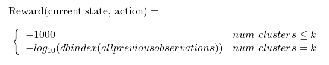
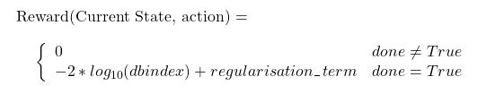

# Clustering Environments

## clustering-v0

### Environment config

The environment config looks so:

```python
env_name = "clustering-v0"

env_config = {
    'data': data, # Data in the form of a dataframe
    'k': k # Num Clusters
}
```

The parameters are self explanatory.

### Environment Variables

The major environment variables are the following:

```python
## env is the environment object

env.reward_range
# returns a touple which is the range in which the reward can exist for each step
# in this case (-1000,1000)

env.state_space
env.action_space
# Action space here is a Diecrete spaces object with k discrete values.

## To understand more about the spaces object, read the openAI gym documentation
```

### Reward Function

The Reward Function looks like this:



This environment has a reward at each timestep.

## clustering-v1

### Environment config

The environment config looks so:

```python
env_name = "clustering-v1"

env_config = {
    'data': data, # Data in the form of a dataframe
    'k': k # Num Clusters
}
```

The parameters are self explanatory. It is exactly similar to that of clustering-v0

### Environment Variables

The major environment variables are the following:

```python
## env is the environment object

env.reward_range
# returns a touple which is the range in which the reward can exist for each step
# in this case (-100,100)

env.state_space
env.action_space
# Action space here is a Diecrete spaces object with k discrete values.

## To understand more about the spaces object, read the openAI gym documentation
```

### Reward Function

The reward function is quite simply defined as follows:



The regularization term is a minute quantity which tries to make sure that no one cluster fully takes over the entire dataset if the clusters are close by. This environment has a reward only at the end of each episode.

## clustering-v2

### Environment config

The environment config looks so:

```python
env_name = "clustering-v2"

env_config = {
    'data': data,
    'k': k,
    'max_steps': max_steps,
    'lr': learning_rate
}
```

The parameters are self explanatory.

### Environment Variables

The major environment variables are the following:

```python
## env is the environment object

env.reward_range
# returns a touple which is the range in which the reward can exist for each step
# in this case (-1,1)

env.state_space
env.action_space
# Action space here is a Diecrete spaces object with k discrete values.

## To understand more about the spaces object, read the openAI gym documentation
```

### Reward Function

The reward function is quite simply defined as follows:

reward = p               if yi = 1
reward = -1 * (1-p)   if yi = 0

## clustering-v3

### Environment config

The environment config looks so:

```python
env_name = "clustering-v3"

env_config = {
    'data': data,
    'k': k
}
```

The parameters are self explanatory.

### Environment Variables

The major environment variables are the following:

```python
## env is the environment object

env.reward_range
# returns a touple which is the range in which the reward can exist for each step
# in this case (-1,1)

env.state_space
env.action_space
# Action space here is a Diecrete spaces object with k discrete values.

## To understand more about the spaces object, read the openAI gym documentation
```

### Reward Function

The reward function is quite simply defined as follows:

reward = 1 if chosen centroid is the closest centroid
reward = -1 otherwise